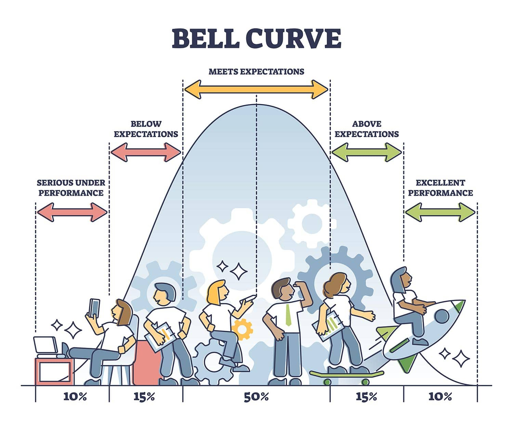
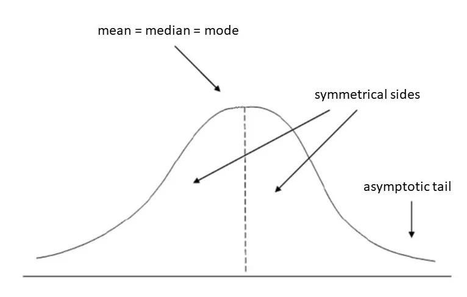

# Basic Classical Statistics (with Python)

This course is intended for students from life sciences such as biologists and ecologists who are interested in research but have no prior knowledge of basic statistics or any coding languages such as python or R.

Research in most field entails designing experiments, in a scientific and systematic manner,  collecting data from the experiments and then analysing the data mathematically to make inferences. Therfore, all researchers have to have some knowledge of experiment desigg, data analysis and finally data visualization to communicate the results clearly.

Python is a scripting language and is currently the most widely used for data analysis with statistical methods and artificial intelligence (AI)/ML (machine learning). Python is used both in the academia as well as in the industry, therefore students trained in Python can switch with ease from academia to researchand development in the industry.

We will learn some good practices for developing code and collaborating on coding projects with others. GitHub is an online opensource platform for software project development and for version control of source code via Git. Section 1 is introduction to Git and Github (basics) just enough to get started. You can learn the interemdiate and advanced features on your own from online documents on Git and and Github.


# Content

* [Section 1: Git and Github](#Section1)
    - [Section 1.1: Git](#Git)
    - [Section 1.2: Github](#Github)
    - [Section 1.3: How to install Git](#How-to-install-Git)
    - [Section 1.4: How to clone a repository form GitHub](#Git-clone)
    - [Section 1.6: How to switch branch](#Git-checkout)
    - [Section 1.7: How to update a branch](#Git-pull)
    - [Section 1.8: How to merge from main into branch](#Git-merge-main-into-branch)
    - [Section 1.9: How to merge a branch into main](#Git-merge-branch-into-main)

* [Section 2: Python virtual environment](#Section2)
* [Section 3: Normal Distribution,mean, median, mode and standard deviation](#Section3)
* [Section 4: Central Limits Theorem, sample size, statistical power](#Section4)

<div id="Section1"></div>

# Git and Github

<div id="Git"></div>

## Git

A software tool for code version control

You can save snapshots of your code. Typically when you have a bug free and working version of your code, you "commit" (take a snap shot) of the code to your repository. You then continue to edit your code to add more functionality. But at times, your code may no longer work because of errors in your logic and you may want to revert back to the older version of your code. With git version control it is possible for you to retrieve older versions of your code.

<div id="Github"></div>

## Github

It is an online platform for creating code repositories that can be shared by many people. Software projects usually have many people collaborating on code development. Github code repositories make it possible to share and edit code in a systematic manner with git version control.

<div id="How-to-install-Git"></div>

## How to install Git

On windows we can install Git by installing Github.
But first create an account on Github. It is free.

https://docs.github.com/en/get-started/start-your-journey/creating-an-account-on-github


<div id="Git-clone"></div>

## How to clone a repository form Github

On the terminal (command line) type:

git clone "the-url-of-the-repository"

example:

```

git clone https://github.com/KrugerElephant/stats101.git

```

<div id="Git-branches"></div>

## Git branches for collaborative code development

Typically multiple people work on a project. 

The work is split into modular tasks and each task gets assigned to one person.

That person creates a "branch" version of the code from the "main" of the code.

That person can edit existing files, add new files or delete files on the branch, without affecting other tasks done by another person on their branch.

After the task is completed and is error free, the code is "merged" back into the "main" branch.

But before merging the branch into main, the branch is updated with code form the main (some other person may have updated the main with their code) and you would not want to overwrite their changes when you merge your code into main.

Let us configure some user name and user email parameters before we colloborate on a project.
This helps us keep track of the chnages made.

This is how I configured my email and user name. Replace my credentials with yours.

```

git config --global user.email "karpakazi@gmail.com"

```


```

git config --global user.name "karpagam"


```

## How to create a branch from the main


<div id="Git-checkout"></div>

You can create a branch from the command line like so. The "my-branch-01" is an example. You can give an appropriate name for your branch and it is usually indicative of the task for which you are creating a branch.

But we will create branches from out GitHub project Stats101 which is linked to this stata101 code repository.

```

git check-out -b my-branch-01


```


## How to switch branch


<div id="Git-pull"></div>

## How to update a branch


<div id="Git-merge-main-into-branch"></div>

## How to merge main into branch

<div id="Git-merge-branch-into-main"></div>


## How to merge branch into main

<div id="Section2"></div>

 # Python Virtual Environment

A Virtual Environment is an isolated working copy of Python for each project you create. In thi manner you can customize the python environment for a project without affecting other projects. 

For now just learn how to set up python "virtual environment" for developing code.
Once you start writing some code, installing python "libraries" or "packages", you will begin to understand why we create "virtual environments" for developing code.


**How to create python vnenv**

On the terminal

1. pip install virtualenv
2. python -m venv .venv
3. source .venv/bin/activate


<div id="Section3"></div>

# Normal Distribution, mean, median, mode, variance and standard deviation

**Population and Sample**

What is a population?

The entire group on which you would like to collect information on.

A hypothetical example of a population could be all the 10000 students of Jadavpur university and the information you may want to collect may be the average weights of the students. You may also want to examine the average weight of the students by gender.

* average weight = sum of all the students' weight / total number of students

* average female weight = sum of all the female students' weight / total number of female students

* average male weight = sum of all the female students' weight / total number of female students

So how will you find out this information?

Will you measure the weights of all the students?

It will cost time and money to measure all the students.

Is it possible to arrive at the answers you seek by measuring the weights of a subset of the students instead? That would be nice as you can save time and money.

But before we go about sampling a subset of data, let us investigate the properties of the data of the "population".

It so happens that some of the phenomena in nature have values that are distributed more or less symmetrically about the mid point of their data range.

Most values in the data are near the center of the range of the data. For example the weight of adult humans in kilograms in Asia. The range is 45 to 85 kilos and most people weight around 65 kilos 

The center of the range is the mean or the average of the data. 

As you go further and further away from the center or the mean the frequency of data points decreases. Extreme values on either side are very very very rare. 

This kind of behaviour produces a frequencey distribution curve that looks like a bell. 

Data with such a bell shape are said to be "normally distributed" about the mean.

**Normal distribution (The Bell Shaped Curve) is also know as Gaussian distribution**



[Source: https://www.simplypsychology.org/normal-distribution.html]

**Mean, median, mode and standard deviation**



[Source: https://www.simplypsychology.org/normal-distribution.html]

<div id="Section4"></div>

The Central limits theorem, sample size and statistical power
-------------------------------------------------------------
